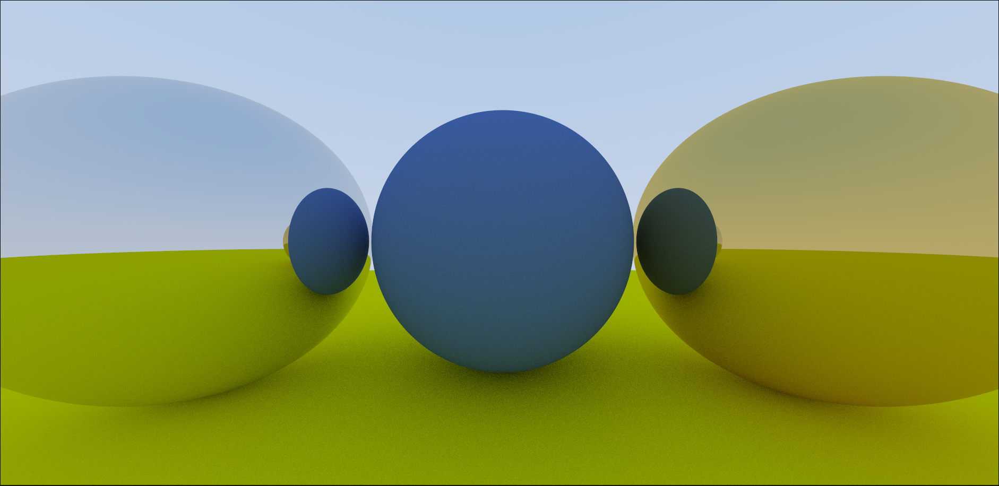

# Material SPHERES interacting on Blue-White gradient using rays and AntiAliasing + Diffusion + Gamma Correction + Lambert Reflection

### 1. Configure and build the project
```bash
mkdir build && cd build
cmake ..
```

### 2. Clean, rebuild, generate image.ppm, and open in mpv
```bash
cmake --build . --target clean_view
```
This will:
- Remove old binaries and images  
- Recompile the program  
- Run the ray tracer → image.ppm  
- Open it in mpv  

✅ If you only want to build (without running), use:
```bash
cmake --build .
```
✅ If you only want to view the image (after it’s built), use:
```bash
cmake --build . --target view
```

## 90 vs 115 vFOV for same picture


### Preview for Metal + lambart materials interacting + all previous concepts


### Preview for Glass ball refraction (With TIR) with Schlick's Approximation


### Preview for AntiAliasing + diffusion(with recursion limit) + gamma correction + lambert reflection (bias)


