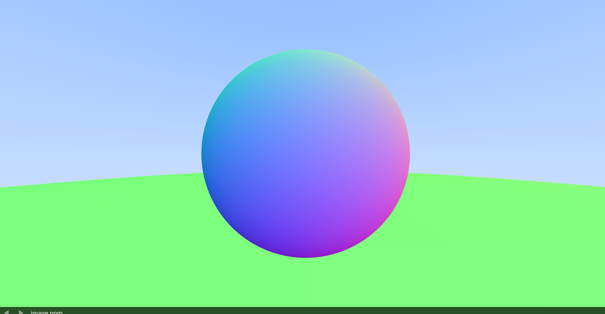
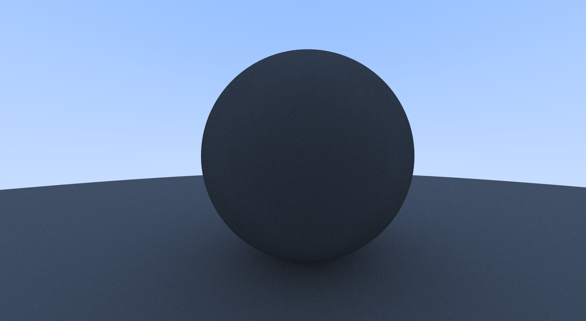
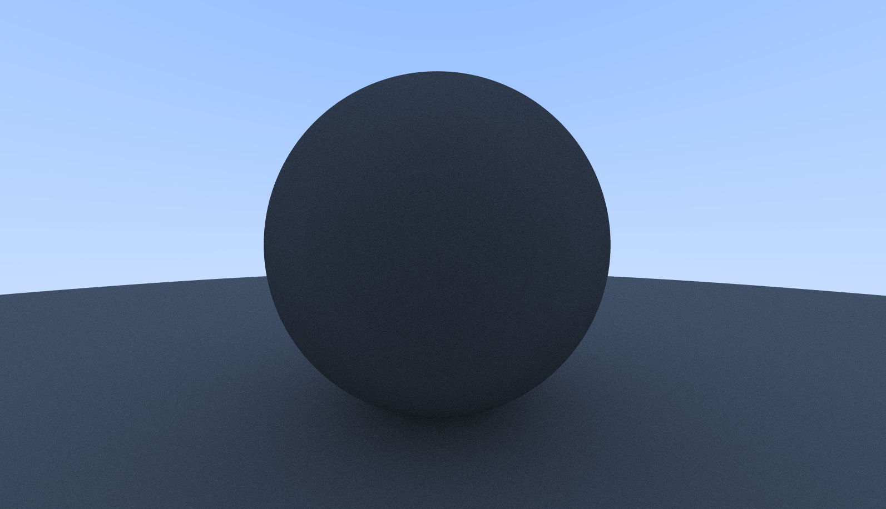

# TWO SPHERES on Blue-White gradient using rays and AntiAliasing

### 1. Configure and build the project
```bash
mkdir build && cd build
cmake ..
```

### 2. Clean, rebuild, generate image.ppm, and open in mpv
```bash
cmake --build . --target clean_view
```
This will:
- Remove old binaries and images  
- Recompile the program  
- Run the ray tracer → image.ppm  
- Open it in mpv  

✅ If you only want to build (without running), use:
```bash
cmake --build .
```
✅ If you only want to view the image (after it’s built), use:
```bash
cmake --build . --target view
```
### Preview for AntiAlias


### Preview for Diffusion + AntiAliasing

