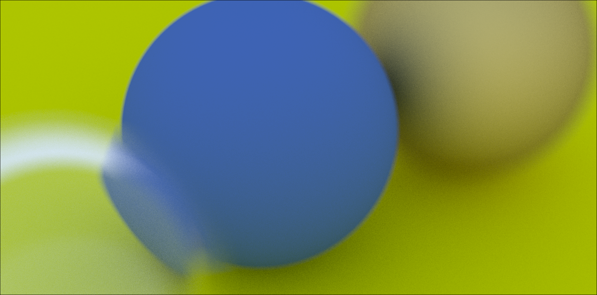

# Ray Tracing Engine — Iterative Builds

### Cover Photo


A progressive implementation of a C++ Ray Tracer engine, built and visualized through multiple incremental versions — from basic sphere rendering to realistic materials, refraction, and depth of field.

Each iteration builds on the previous, adding new rendering concepts and camera features.

---

## Build & Run Instructions

### 1. Configure and build the project
```
mkdir build && cd build
cmake ..
```

### 2. Clean, rebuild, generate image.ppm, and open in mpv
```
cmake --build . --target clean_view
```
This will:
- Remove old binaries and images
- Recompile the program
- Run the ray tracer → image.ppm
- Open it automatically in mpv

✅ If you only want to build (without running):
```
cmake --build .
```

✅ If you only want to view the image (after it’s built):
```
cmake --build . --target view
```

---

# Stage 1: SPHERE on Blue-White Gradient using Rays

Concepts implemented:
- Basic ray-sphere intersection
- Simple blue-white background gradient

Preview:


---

# Stage 2: A SPHERE with Anti-Aliasing, Diffusion, Gamma Correction, and Lambert Reflection

New concepts introduced:
- Anti-aliasing via stochastic supersampling
- Diffuse scattering for matte surfaces
- Recursive ray tracing with depth limit
- Gamma correction for perceptual brightness
- Lambertian reflection model for realistic diffuse shading

Preview for AntiAliasing + Diffusion (with recursion limit) + Gamma Correction + Lambert Reflection:


Preview for Diffusion + AntiAliasing:


With recursion limit:


Preview for AntiAlias only:


---

# Stage 3: Material Spheres — Diffuse, Metal, and Dielectric Interactions

New concepts:
- Multiple material types interacting:
  - Lambertian (diffuse)
  - Metal (specular reflection with fuzziness)
  - Dielectric (refraction + reflection)
- Implementation of Schlick’s Approximation for realistic reflection ratio at dielectric boundaries
- Retained anti-aliasing, diffusion, gamma correction, recursion limit

Preview for Metal + Lambert materials interacting (with all previous concepts):


Preview for Glass ball refraction (with TIR) using Schlick’s Approximation:


---

# Stage 4: Camera Enhancements — Adjustable Field of View & Rotation

New camera features:
- Adjustable vertical FOV (vfov)
- Full camera orientation control using:
  - lookfrom (camera position)
  - lookat (target point)
  - vup (up direction)
- Proper aspect ratio handling
- Perspective distortion from FOV changes

90° vs 115° Vertical FOV Comparison:
<p>
  
  
</p>

Camera Rotation Demonstration:
<p>
  
  
</p>

---

# Stage 5: Depth of Field (Defocus Blur)

Concepts implemented:
- Defocus blur / Depth of field using thin-lens approximation
- Adjustable:
  - defocus_angle → controls aperture size (blur strength)
  - focus_dist → distance where objects appear sharp
- Rays fired from random points on a defocus disk (lens) instead of the camera center
- Objects away from focus plane appear naturally blurred

Preview of Depth of Field Effect (Defocus Blur):


---

# Stage 6: Combined Effects Showcase

Final integrated renderer includes:
- Anti-aliasing
- Diffuse reflection
- Gamma correction
- Lambertian materials
- Metallic and dielectric materials
- Total internal reflection with Schlick’s approximation
- Adjustable camera (FOV, orientation)
- Depth of field with defocus blur

Preview:


---

# Build System Details

This project uses CMake for building and a custom clean_view target for rapid testing:
- clean_view = clean → build → render → open automatically in mpv
- view = reopens last rendered image
- Output image: image.ppm in the build directory

---

# Learning Progression

| Stage | Key Concept | Description |
|--------|--------------|--------------|
| 1 | Rays + Sphere Intersection | Basic math foundation |
| 2 | Diffusion + AntiAliasing | Introduces stochastic sampling |
| 3 | Materials | Realistic interactions between surfaces |
| 4 | FOV + Camera Orientation | Perspective and direction control |
| 5 | Defocus Blur | Depth of field realism |
| 6 | Final Renderer | All effects integrated |

---


### TODO
Integrate CUDA computing (parallel processing) currently took 7798s to render cover photo!!